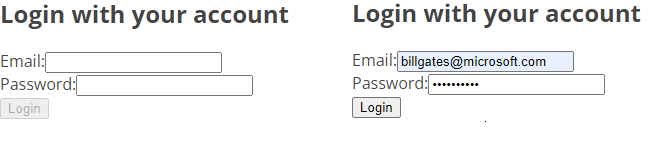

# Tema: Validación de recursos.

### Versión 1.0

Por **Pablo Kipreos** (pjkipreos@uc.cl)

### Video
La cápsula contempla un video, en el siguiente [enlace](https://drive.google.com/file/d/1h5zFjIXB3AToS9E6vFV4DkJUBQVE6VoF/view?usp=sharing) en donde se presenta cómo utilizar el concepto de `context` en React
para poder guardar información y manejar la sesión del usuario a nivel de front-end.

## ¿Qué veremos? 
A lo largo de la cápsula realizaremos 4 pasos principales:

- **Creación del contexto de autentificación**: crearemos un contexto que envolverá la aplicación y nos permitirá autentificar al usuario, además de poder acceder a su información desde cualquier vista.
- **Programar el Log-In**: crearemos una vista para que el usuario pueda ingresar a la página. Se explica como usar el contexto y al usuario ingresado, por medio de *hooks*
- **Cambiar y agregar componentes con autentificación**: modificaremos algunas vistas para que cambien dependiendo de si hay un usuario ingresado.
- **Log-out automático**: siguiendo buenas prácticas de seguridad web, se enseña a lo largo de la cápsula como manejar la expiración de token y un log-out automático.

## ¿Qué es context? 
*Context* es la solución para cuando se necesitan estados globales en la aplicación, evitando cadenas complejas de *props*.

*Context* es un estilo de componente de React que envuelve el árbol de componentes de la aplicación (en la estructura Dom) y permite que todos los hijos (por ejemplo, las vistas que construyamos) puedan acceder a información compartida, tales como el usuario actual o preferencias de navegación.

Puedes leer más sobre Context [aquí](https://reactjs.org/docs/context.html)


## Programando nuestro `AuthContext`

Primero, es importante que creemos dos carpetas nuevas en nuestra aplicación, con nombres `contexts` y `hooks`.

Nuestro contexto va a permitir usar los siguientes atributos y métodos:

- `currentUser`, para obtener el usuario actual. `storeUser`, para setear el valor del usuario actual.
- `handleUserLogin`: este método nos permitirá autentificar al usuario.
- `handleUserLogout`: este método nos permitirá terminar la sesión del usuario.

La función que usaremos como componente se llamará `AuthContextProvider` y retorna lo siguiente:

```javascript
  return (
    <AuthContext.Provider value={userStatus}>
      {children}
    </AuthContext.Provider>
  );
```

Como se puede ver, nuestro contexto envuelve todos los componentes que usará nuestra App, que aquí referimos como `children`.

Algo importante a notar es el trozo de código `value={userStatus}`. Cuando le damos un `value` a el proveedor de contexto, esto nos permite usar los valores entregados 
dentro del contexto (en este caso, `userStatus` corresponde a `currentUser`, `handleUserLogin`, `handleUserLogout`).

Es **muy importante** que agreguemos el componente `AuthContextProvider` en nuestro archivo `App.jsx`

Iniciamos con
```javascript
import AuthContextProvider from './contexts/AuthContext';
```

y luego envolvemos las rutas
```javascript
const App = function () {
  return (
    <BrowserRouter>
      <AuthContextProvider>
        <Navbar />
        <main>
          <Routes>
            <Route index element={<Home />} />
            <Route path="artists" element={<ArtistList />} />
            <Route path="artists/:id" element={<ArtistDetail />} />
            <Route path="*" element={<NotFound />} />
          </Routes>
        </main>
      </AuthContextProvider>
    </BrowserRouter>
  );
};
```

Puedes leer más sobre Context Provider [aquí](https://reactjs.org/docs/context.html#contextprovider)

## Manejando el Log-in

Primero, es importante que creemos nuestro hook para poder utilizar los elementos del contexto.

Para esto, creamos un archivo `useAuth.js` dentro de nuestra carpeta `hooks`

```javascript
import { useContext } from 'react';
import { AuthContext } from '../contexts/AuthContext';

export default () => useContext(AuthContext);
```

Ahora, cuando queramos usar los valores de nuestra carpeta, podemos simplemente importar nuestro hook,
y utilizar *object destructuring* para obtener los elementos que necesitamos. Por ejemplo, en nuestra vista de
*login* utilizaremos `currentUser` y `handleUserLogin`

```javascript
import useAuth from '../hooks/useAuth';

[...]

    const { currentUser, handleUserLogin } = useAuth();
```

Algo que no se pudo ver bien en la cápsula son los efectos de este botón:

```html
<button type="submit" disabled={!(values.email && values.password)}>Login</button>
```

La idea es que estará deshabilitado mientras no haya al menos un valor en los campos de email y contraseña, como se puede apreciar en la imagen




## Utilizando autentificación en nuestros componentes

Como ya vimos con el *log-in*, podemos importar nuestro *hook* para usar los valores de nuestro contexto.

```javascript
import useAuth from '../hooks/useAuth';
```

un ejemplo que se muestra en la cápsula es como cambiar un botón dependiendo de si un usuario ha ingresado, por medio de operadores ternarios. En la Navbar, cambiamos el boton de log-in por log-out en caso de que haya un usuario

```javascript
import useAuth from '../hooks/useAuth';
const Navbar = function () {
  const { currentUser, handleUserLogout } = useAuth();
```

y el botón queda
```javascript
{currentUser ? (
    <button type="button" onClick={handleUserLogout}>Logout</button>
) : (
    <Link to="login">Log In</Link>
)}
```

## Manteniendo la sesión

Un último problema que tenemos que manejar es el caso de que se cargue una página de nuestr aplicación de una forma externa, como escribiendo la ruta directamente en el navegador o refrescando la página. Para esto, utilizamos `Local Storage`, que nos permite escribir texto en disco cosa de que podamos guardar cierta información en un archivo y usarla entre sesiones.

Para esto, crearemos un nuevo hook llamado `useLocalStorage` dentro de nuestra carpeta `hooks`.

```javascript
import { useState } from 'react';

const useLocalStorage = (key, initialValue = null) => {
  const [storedValue, setStoredValue] = useState(() => {
    try {
      const item = localStorage.getItem(key);
      return item ? JSON.parse(item) : initialValue;
    } catch (error) {
      return initialValue;
    }
  });

  const setValue = (value) => {
    localStorage.setItem(key, JSON.stringify(value));
    setStoredValue(value);
  };

  const clearValue = () => {
    localStorage.removeItem(key);
    setStoredValue(null);
  };

  return [storedValue, setValue, clearValue];
};

export default useLocalStorage;
```

Aquí importamos los métodos `storedValue`, `setValue`, `clearValue`, que reemplazaran los métodos correspondientes del `useState` que estabamos usando hasta ahora. Para arreglar el problema descrito, tendremos que usar este hook en nuestro contexto.

Importamos el hook
```javascript
import useLocalStorage from '../hooks/useLocalStorage';
```
y cambiamos las lineas del `useState`

```javascript
  const [currentUser, storeUser, clearStoredUser] = useLocalStorage('user');
  const [sessionExpDate, storeSessionExpDate, clearSessionExpDate] = useLocalStorage('sessionExpiration');
```

hay que tener ojo que tenemos que cambiar cualquier referencia antigua, como `setUser` por nuestro nuevo `storeUser`.


## Referencias 
- [Context](https://reactjs.org/docs/context.html)
- [UseState, useEffect y otros hooks](https://reactjs.org/docs/hooks-reference.html)
- [Local storage](https://www.w3schools.com/jsref/prop_win_localstorage.asp)

